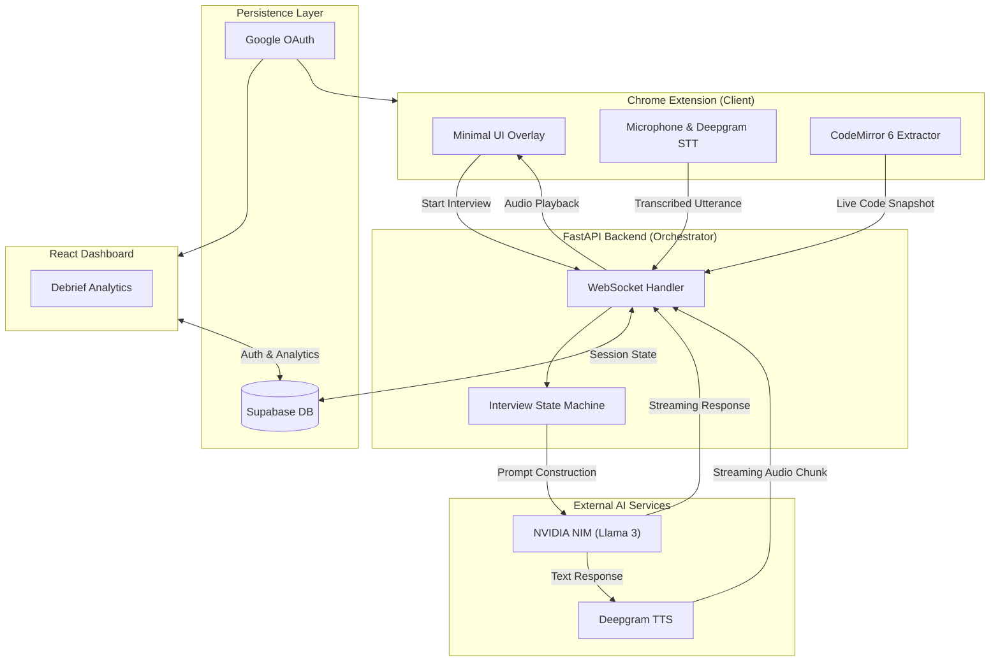

<div align="center">
  <!-- Use a clean placeholder logo for now -->
  
  <h1>LeeView</h1>
  <p><b>Transforming every LeetCode problem into a real-time, AI-driven mock interview.</b></p>
</div>

LeeView is the definitive copilot for technical interview preparation. We inject a seamless, unobtrusive overlay directly into your LeetCode environment, capturing your voice and code in real-time. Powered by ultra-low latency speech-to-text and LLM orchestration, LeeView dynamically guides you through a full technical interview—from clarifying the problem to writing the code and walking through the solution—giving you a comprehensive debrief the moment you finish. Practice the way you'll actually perform.

---

## Architecture & Data Flow

LeeView operates on a lightning-fast asynchronous architecture designed for real-time human-AI interaction. The Chrome Extension acts as the edge client, continuously syncing editor state and voice data to our FastAPI backend over WebSockets.



## External Services

LeeView leverages the best-in-class AI infrastructure to deliver conversational latency:
- **[Deepgram](https://deepgram.com/)**: Industry-leading Speech-to-Text (STT) and Text-to-Speech (TTS) models.
- **[NVIDIA NIM](https://build.nvidia.com/)**: High-throughput LLM inference for natural, state-aware dialogue.
- **[Supabase](https://supabase.com/)**: Open-source Firebase alternative handling real-time database persistence, session tracking, and Google OAuth.

---

## Quick Start (Local Setup)

To spin up the entire stack locally, ensure you have Python 3.11+, Node.js 18+, and accounts with Supabase, Deepgram, and NVIDIA NIM.

### 1. Database & Auth (Supabase)
1. Create a project at [supabase.com](https://supabase.com) and enable **Google OAuth** in Authentication settings (set redirect URL to `http://localhost:5173`).
2. Run the SQL migrations found in `supabase/migrations/` sequentially.
3. Grab your `SUPABASE_URL`, `SUPABASE_ANON_KEY`, and `SUPABASE_SERVICE_ROLE_KEY`. 

### 2. The Brain (FastAPI Backend)
The backend orchestrates the state machine and interfaces with the AI models via WebSockets.

```bash
cd app/backend
python -m venv .venv
source .venv/bin/activate  # Or .venv\Scripts\activate on Windows
pip install -e ".[dev]"
```

Create an `.env` file in `app/backend`:
```env
SUPABASE_URL=your_url
SUPABASE_SERVICE_ROLE_KEY=your_service_role_key # CRITICAL: Not the anon key
SUPABASE_ANON_KEY=your_anon_key
DEEPGRAM_API_KEY=your_deepgram_key
NVIDIA_NIM_API_KEY=your_nvidia_key
NVIDIA_NIM_BASE_URL=https://integrate.api.nvidia.com/v1
```

Run the server:
```bash
uvicorn src.main:app --reload --port 8000
```

### 3. The Analytics Dashboard (React)
The dashboard provides Google Auth and visualizes your post-interview debriefs.

```bash
cd app/dashboard
npm install
```

Create an `.env` file in `app/dashboard`:
```env
VITE_SUPABASE_URL=your_url
VITE_SUPABASE_ANON_KEY=your_anon_key
```

Run the dashboard:
```bash
npm run dev
```

### 4. The Edge Client (Chrome Extension)
Our extension bridges LeetCode with the backend.

```bash
cd app/extension
npm install
npm run build
```

1. Open Chrome and navigate to `chrome://extensions`.
2. Enable **Developer mode**.
3. Click **Load unpacked** and select the `app/extension/dist/` directory.

### Putting it all together
1. Open the dashboard at `http://localhost:5173` and authenticate with Google.
2. The extension's auth bridge instantly captures your session.
3. Navigate to any LeetCode problem. The "Start Mock Interview" widget will appear. Click it, and practice like it's the real deal.
